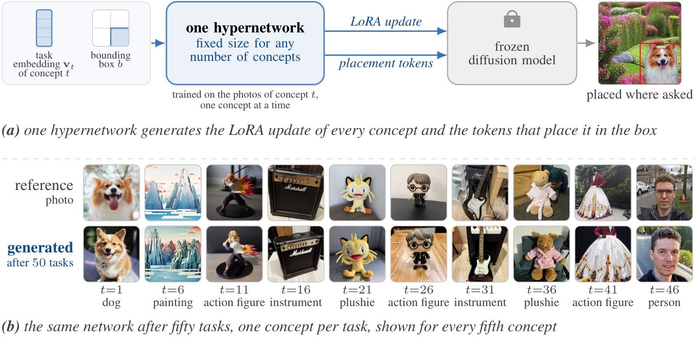

<div align="center">

# CLASP: Continual Low-rank Adapters for Spatially Placed Concepts from One Hypernetwork

**Wojciech Gromski**<sup>1,2</sup> · **Patryk Krukowski**<sup>3,4</sup> · **Jan Miksa**<sup>2,3</sup> · **Maciej Zieba**<sup>1,5</sup> · **Przemysław Spurek**<sup>2,3</sup>

<sup>1</sup>Wrocław University of Science and Technology · <sup>2</sup>IDEAS Research Institute · <sup>3</sup>Jagiellonian University · <sup>4</sup>AKCES NCBR · <sup>5</sup>Tooploox

[](https://genwro-ai.github.io/clasp)
[](https://arxiv.org/abs/2610.01331)
[](LICENSE)

</div>

<p align="center">
  <picture>
    <source media="(prefers-color-scheme: dark)" srcset="website/figures/teaser_dark.png">
    
  </picture>
</p>

**TL;DR.** Personalizing a text-to-image diffusion model with a sequence of new concepts usually
means either forgetting the earlier ones or storing a separate adapter for each, so the model grows
with every concept. CLASP replaces the store with a single hypernetwork of fixed size: from a compact
task embedding it generates each concept's low-rank adapter for a frozen diffusion model, and from
the same embedding and a bounding box it generates tokens that place the concept where the user
asks. An output-space regularizer keeps the adapters of earlier concepts in place as new ones are
learned. On the CIFC benchmark, CLASP forgets about four times less than CIDM and twenty-three times
less than sequential fine-tuning, and it keeps learning to a hundred concepts at the same size and
generation cost.

## Installation

Commands run through [`uv run`](https://docs.astral.sh/uv/), which creates `.venv` from `uv.lock`
on first use. Run them from the repository root. Backbones (SD-1.5, SDXL-base-1.0) and evaluation
models are downloaded on first use.

## Data

Images are not redistributed. `download_data` fetches only the parts used here, at pinned
revisions, of the benchmark of Dong et al. (NeurIPS 2024) and of CustomConcept101 (Kumari et al.,
CVPR 2023). The cutouts and backgrounds for the paste composites are then built once:

```bash
uv run python -m scripts.download_data
uv run python -m scripts.prepare_cc101 --src data/benchmark_dataset
uv run --extra segment python -m scripts.segment_subjects --config configs/sd15_bench10.yaml --out data/seg
uv run python -m scripts.segment_gsam --config configs/sd15_seq100.yaml --out data/seg --only_prefix cc101_
uv run python -m scripts.segment_overrides --config configs/sd15_seq100.yaml --out data/seg
uv run python -m scripts.make_backgrounds --out data/backgrounds
```

Our captions for the added concepts are in `data/captions_cc101/`, and `data/mask_overrides.txt`
records the masks we chose by hand where automatic segmentation failed.

## Usage

```bash
uv run python -m clasp.train --config configs/sd15_bench10.yaml
uv run python -m clasp.generate --config configs/sd15_bench10.yaml --ckpt_dir outputs/sd15_bench10/ckpts \
    --out_root outputs/sd15_bench10/matrix/s045 --lora_scale 0.45 --eval_dtype fp16
uv run python -m clasp.metrics --config configs/sd15_bench10.yaml --eval_root outputs/sd15_bench10/matrix/s045
uv run python -m clasp.placement --config configs/sd15_bench10.yaml \
    --ckpt outputs/sd15_bench10/ckpts/hyper_after_task09.pt --grid 2:0.3 --bootstrap 15 --scaffold_steps 10
```

`scripts/reproduce.sh` lists the commands behind every result.

| config | backbone | concepts |
|---|---|---|
| `configs/sd15_bench10.yaml` | SD-1.5 | the benchmark's ten |
| `configs/sd15_seq50.yaml` | SD-1.5 | the ten and forty from CustomConcept101 |
| `configs/sd15_seq100.yaml` | SD-1.5 | the fifty and fifty more |
| `configs/sdxl_bench10.yaml` | SDXL-base-1.0 | the benchmark's ten |

The SD-1.5 results use seeds 2024, 2025 and 2026. The configs set 2024. For the other two, change
`seed` and `output_dir` in a copy of the config.

## Citation

```bibtex
@article{gromski2026clasp,
  title   = {{CLASP}: Continual Low-rank Adapters for Spatially Placed
             Concepts from One Hypernetwork},
  author  = {Gromski, Wojciech and Krukowski, Patryk and Miksa, Jan and
             Zieba, Maciej and Spurek, Przemys{\l}aw},
  journal = {arXiv preprint arXiv:2610.01331},
  year    = {2026}
}
```

## Project page

The page in `website/` is built with [Quarto](https://quarto.org) from the
[genwro.AI paper website template](https://github.com/genwro-ai/paper-website-template) and
published to GitHub Pages on every push to `main` that changes it. Run `quarto preview` inside
`website/` to see it locally.

## License

The code is released under the [MIT License](LICENSE). The benchmark images are not part of this
repository and keep the licenses of their datasets.
