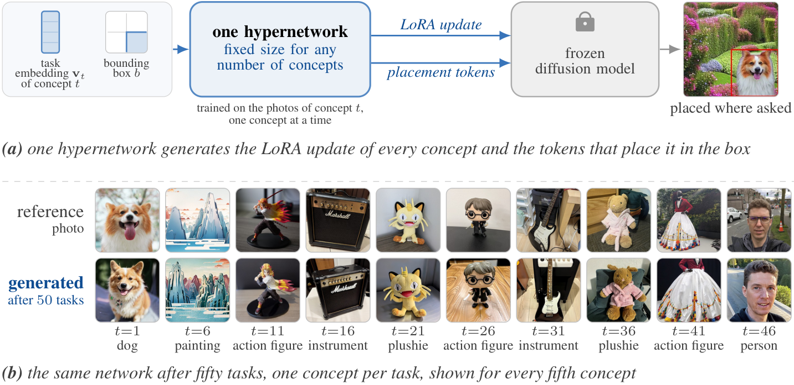

{.teaser fig-align="center" fig-alt="CLASP overview and generations after fifty concepts"}

```{=html}
<div class="stat-row">
  <div class="stat"><div class="stat-num">26.0&nbsp;M</div><div class="stat-lab">parameters, the same after 10, 50 or 100 concepts</div></div>
  <div class="stat"><div class="stat-num">2&nbsp;×&nbsp;256</div><div class="stat-lab">numbers stored per new concept (CIDM: 0.42&nbsp;M)</div></div>
  <div class="stat"><div class="stat-num">+14%</div><div class="stat-lab">generation time at every length (CIDM: up to +154%)</div></div>
  <div class="stat"><div class="stat-num">100</div><div class="stat-lab">concepts learned in sequence (CIDM stops at 37)</div></div>
</div>
```

::: {.abstract}
Personalizing a text-to-image diffusion model with a sequence of new concepts usually means either
forgetting the earlier ones or storing a separate adapter for each, so the model grows with every
concept. CLASP replaces the store with a single hypernetwork of fixed size: from a compact task
embedding it generates each concept's low-rank adapter for a frozen diffusion model, and from the
same embedding and a bounding box it generates tokens that place the concept where the user asks.
An output-space regularizer keeps the adapters of earlier concepts in place as new ones are learned.
On the CIFC benchmark, CLASP forgets about four times less than CIDM and twenty-three times less
than sequential fine-tuning, and it keeps learning to a hundred concepts at the same size and
generation cost.
:::


## Concepts that stay

Drag the slider to move through the ten-concept sequence. Next to its reference photos, each column shows the same concept, generated
after the given task from the same prompt and the same initial noise, by our fixed-size network, by
CIDM, which stores an adapter for every concept, and by sequential fine-tuning on the same budget.

```{=html}
<div class="widget" id="forget-widget">
  <div class="widget-controls">
    <div class="seg" role="tablist" aria-label="Concept">
      <button data-c="0" class="on">dog</button><button data-c="1">duck toy</button><button data-c="2">cat</button>
    </div>
    <button class="ghost" id="fw-seed" title="Show another seed">&#8635; another seed</button>
  </div>
  <div class="fw-rows">
    <figure class="fw-cell fw-ref"><div class="fw-refgrid" id="fw-ref"></div><figcaption class="m-ref">Reference photos</figcaption></figure>
    <figure class="fw-cell"><figcaption class="m-ours">Ours</figcaption></figure>
    <figure class="fw-cell"><figcaption class="m-cidm">CIDM</figcaption></figure>
    <figure class="fw-cell"><figcaption class="m-ft">Fine-tuning</figcaption></figure>
  </div>
  <div class="fw-slider">
    <button class="ghost play" id="fw-play" aria-label="Play">&#9654;&#xFE0E;</button>
    <input type="range" id="fw-k" min="0" max="9" step="1" value="9" aria-label="After task">
    <span class="fw-k-label">after task <b id="fw-k-val">10</b> of 10</span>
  </div>
  <p class="widget-note" id="fw-note"></p>
</div>
```

## Forgetting, measured

Forgetting is the drop in DINO similarity from each concept's best score to its score at the end
of the ten-concept sequence. All three methods are read at nearly the same text alignment, on
SD-1.5, as the mean and standard deviation over three training seeds.

```{=html}
<div class="widget chart-card" id="forget-chart">
  <svg id="fc-svg" viewBox="0 0 640 196" role="img" aria-labelledby="fc-title fc-desc">
    <title id="fc-title">Forgetting over the ten-concept sequence</title>
    <desc id="fc-desc">Ours 0.0060, CIDM 0.0232, sequential fine-tuning 0.1386 DINO. Lower is better.</desc>
  </svg>
  <div class="fc-tip" id="fc-tip" role="tooltip"></div>
  <table class="fc-table sr-only">
    <caption>Forgetting (DINO, lower is better)</caption>
    <tr><th>Method</th><th>Forgetting</th><th>Text alignment</th></tr>
    <tr><td>Ours</td><td>0.0060 ± 0.0031</td><td>75.6</td></tr>
    <tr><td>CIDM</td><td>0.0232 ± 0.0014</td><td>75.9</td></tr>
    <tr><td>Fine-tuning</td><td>0.1386 ± 0.0042</td><td>75.5</td></tr>
  </table>
</div>
```

## Fixed size, fixed cost

A per-concept method grows with every concept it learns: CIDM stores an adapter and its token
embeddings for each one, and runs all of them at every denoising step. Our network keeps its
size, a new concept adds only its task embedding, and generation costs the same at any length.

```{=html}
<div class="widget chart-card" id="cost-chart">
  <svg id="cc-svg" viewBox="0 0 640 250" role="img" aria-labelledby="cc-title cc-desc">
    <title id="cc-title">Generation time added to the frozen backbone</title>
    <desc id="cc-desc">Ours adds 14 percent at 10, 37 and 100 concepts. CIDM adds 45 percent at 10 concepts and 154 percent at 37, and does not run beyond 37.</desc>
  </svg>
  <div class="fc-tip" id="cc-tip" role="tooltip"></div>
  <table class="sr-only">
    <caption>Generation time added to the frozen backbone</caption>
    <tr><th>Concepts</th><th>Ours</th><th>CIDM</th></tr>
    <tr><td>10</td><td>+14%</td><td>+45%</td></tr>
    <tr><td>37</td><td>+14%</td><td>+154%</td></tr>
    <tr><td>100</td><td>+14%</td><td>does not run</td></tr>
  </table>
  <p class="widget-note">Measured on one A100, batch size 5, 50 DPM-Solver steps, fp32, median over 12 batches.</p>
</div>
```

## Put a concept where you want it

Pick a concept and click a quadrant. The dashed box is the region we ask for. The images are those
of Figure 7 in the paper.

```{=html}
<div class="widget" id="place-widget">
  <div class="pw-body">
    <div class="pw-side">
      <div class="seg" role="tablist" aria-label="Concept">
        <button data-c="teddybear" class="on">teddy bear</button><button data-c="ducktoy">duck toy</button>
      </div>
      <div class="pw-picker" aria-label="Choose a quadrant">
        <button data-q="TL" class="on" aria-label="top left"></button><button data-q="TR" aria-label="top right"></button>
        <button data-q="BL" aria-label="bottom left"></button><button data-q="BR" aria-label="bottom right"></button>
      </div>
      <span class="pw-hint">click a quadrant</span>
      <div class="pw-legend"><span class="lg-req"></span> requested box</div>
    </div>
    <div class="pw-main">
      <div class="pw-stage" id="pw-stage">
        
        <div class="pw-box" id="pw-box"><svg><rect x="1.5" y="1.5" rx="3" style="width:calc(100% - 3px);height:calc(100% - 3px)"></rect></svg></div>
      </div>
    </div>
  </div>
  <p class="widget-note pw-prompt" id="pw-note"></p>
</div>
<script src="assets/widgets.js"></script>
```

## Citation

```{=html}
<button class="ghost copy-bib" id="copy-bib">Copy BibTeX</button>
```

```bibtex
@article{gromski2026clasp,
  title   = {{CLASP}: Continual Low-rank Adapters for Spatially Placed
             Concepts from One Hypernetwork},
  author  = {Gromski, Wojciech and Krukowski, Patryk and Miksa, Jan and
             Zieba, Maciej and Spurek, Przemys{\l}aw},
  journal = {arXiv preprint arXiv:2610.01331},
  year    = {2026}
}
```

```{=html}
<footer class="page-foot">Project page built with the <a href="https://github.com/genwro-ai/paper-website-template" target="_blank" rel="noopener">genwro.AI paper template</a></footer>
```
